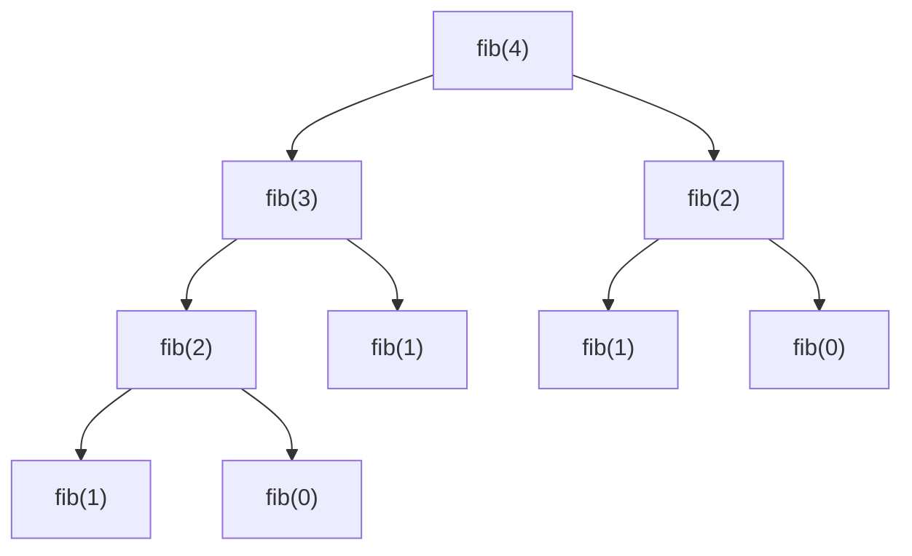

## 定義

**費氏數列（Fibonacci Number）** 的遞迴定義：

$$
F_n = \begin{cases}
0 & \text{, if } n = 0 \\
1 & \text{, if } n = 1 \\
F_{n-1} + F_{n-2} & \text{, if } n \geq 2
\end{cases}
$$

屬於 [[遞迴Recursion基礎與範例分類|遞迴]] 的數學類經典範例，其特徵是**單一遞迴呼叫式中出現兩個遞迴呼叫**（$F_{n-1}$ 與 $F_{n-2}$），這使得原始遞迴實作的時間複雜度呈指數成長 $O(2^n)$（會有大量重複計算），是遞迴效率議題的經典引言。

## 核心模型/公式

### 遞迴演算法（C 語言）

```c
int fib(int n) {
    if (n == 0) return 0;
    if (n == 1) return 1;
    return fib(n-1) + fib(n-2);
}
```

### 遞迴呼叫樹（以 fib(4) 為例）



可明顯看出 `fib(2)` 被重複計算多次，這是遞迴法在效率上的主要缺點，也是後續動態規劃（記憶化）技巧的動機來源。
