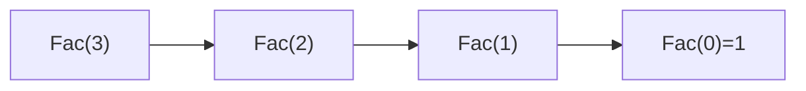

## 定義

**階乘（Factorial）** 的遞迴定義：

$$
n! = \begin{cases} 1 & \text{, if } n = 0 \\ n \times (n-1)! & \text{, if } n \geq 1 \end{cases}
$$

**二項式係數（Binomial Coefficient）** $\binom{n}{m}$ 的遞迴定義：

$$
\binom{n}{m} = \begin{cases} 1 & \text{, if } m = n \text{ or } m = 0 \\ \binom{n-1}{m} + \binom{n-1}{m-1} & \text{, otherwise} \end{cases}
$$

兩者皆屬於 [[遞迴Recursion基礎與範例分類|遞迴]] 的數學類經典範例，證明了「終止條件 + 縮小規模的遞迴呼叫」的基本設計模式。

## 核心模型/公式

### Factorial 遞迴演算法

```
Procedure Fac(int n)
begin
    if (n == 0) return 1;
    else return n * Fac(n-1);
end.
```

### 例題：Fac(3) 的呼叫次數

$$
\text{Fac}(3) \to 3 \times \text{Fac}(2) \to 2 \times \text{Fac}(1) \to 1 \times \text{Fac}(0) \to 1
$$



$\text{Fac}(3) = 6$，共呼叫 **4 次**（含 Fac(3) 本身）。一般化：計算 $\text{Fac}(n)$ 共呼叫 $n+1$ 次。

### Binomial Coefficient 遞迴演算法

```
int Bin(int n, int m) {
    if (n == m || m == 0) return 1;
    else return (Bin(n-1, m) + Bin(n-1, m-1));
}
```

### 例題：$\binom{5}{3}$

$$
\binom{5}{3} = 10
$$

展開遞迴呼叫樹（Recursion Tree）共呼叫 **19 次**。此類題型的解題重點：畫出遞迴呼叫樹，逐層數節點數即為呼叫次數。
